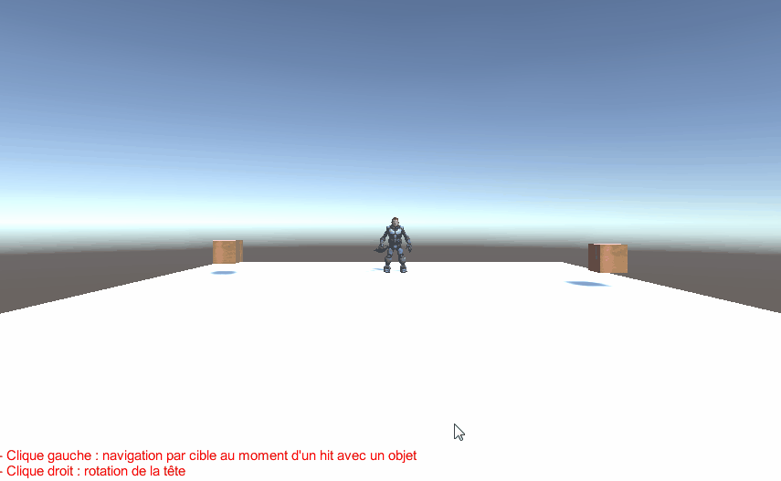
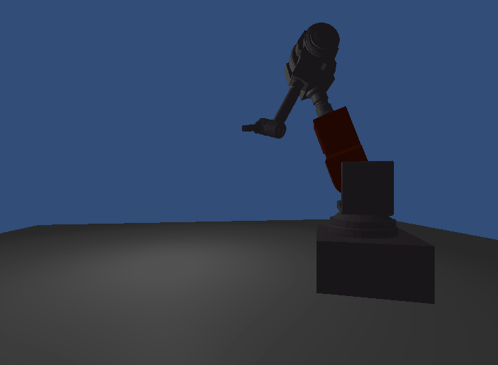
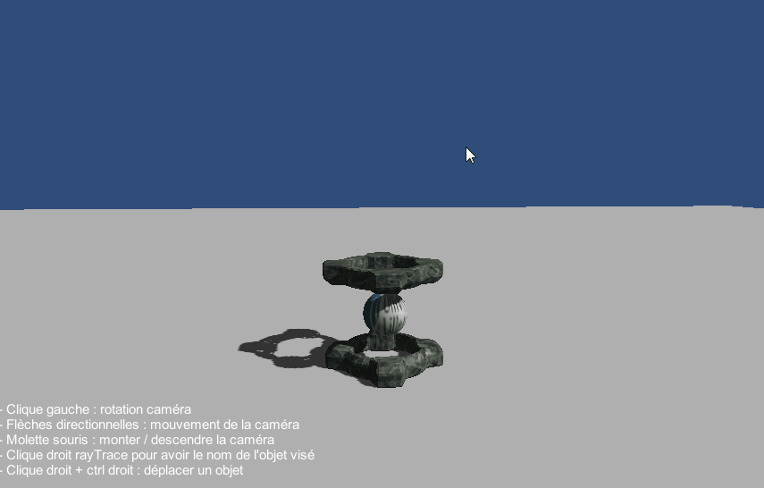

#Different projects made under Unity3D

###Overview of the various exercises done during the "Réalité virtuelle et interaction" course from Master 2 IVI (Lille 1 University)

__________________________________________________________
##Teleport and goals

__________________________________________________________
##Create spheres with Physics

__________________________________________________________
##Navigation with a Drag'n Go technique

__________________________________________________________
##Map creation and navigation

__________________________________________________________
##Particles systems and animation with Keyframes

__________________________________________________________
##Navigate and scripted animation of a soldier

__________________________________________________________
##Manipulate and get informations

__________________________________________________________
##Use surface shader on a sphere

__________________________________________________________
##Use vertex shader

__________________________________________________________
##Creation of a mountain with vertex and fragment shaders
